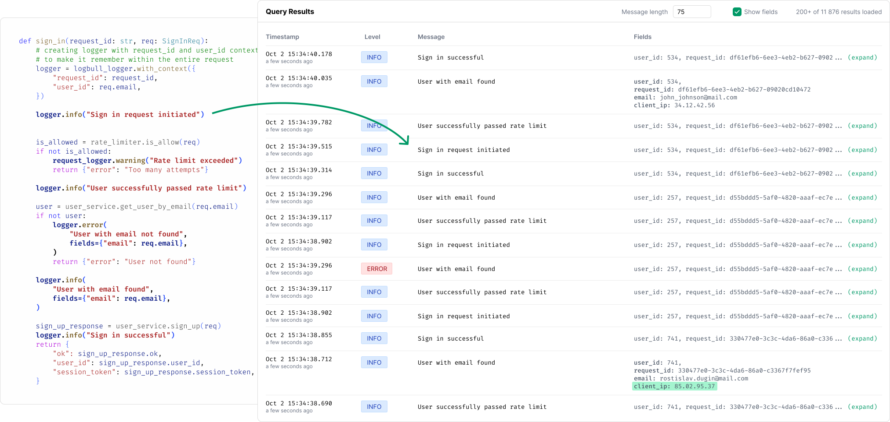

<div align="center">
  

  <h3>Simple log collection and view system for developers</h3>
  <p>Simple alternative to ELK and Loki. Self-hosted, zero-config, open source</p>
  
  <!-- Badges -->
  [](LICENSE)
  [](https://hub.docker.com/r/logbull/logbull)
  [](#)
  [](#)
  [](#)
  
  <p>
    <a href="#-features">Features</a> •
    <a href="#-system-requirements">System Requirements</a> •
    <a href="#-installation">Installation</a> •
    <a href="#-usage">Usage</a> •
    <a href="#-license">License</a> •
    <a href="#-contributing">Contributing</a>
  </p>

  <p style="margin-top: 20px; margin-bottom: 20px; font-size: 1.2em;">
    <a href="https://logbull.com" target="_blank"><strong>🌐 Log Bull website</strong></a>
  </p>

  
</div>

To send logs you have libraries for many languages. Just a Python example:

```python
from logbull import LogBullLogger

# Initialize logger
logger = LogBullLogger(
    host="http://LOGBULL_HOST",
    project_id="LOGBULL_PROJECT_ID",
    api_key="YOUR_API_KEY"  # optional, if you need it
)

# Log messages (printed to console AND sent to LogBull)
logger.info("User logged in successfully", fields={
    "user_id": "12345",
    "username": "john_doe",
    "ip": "192.168.1.100"
})
```

See more examples on Python, Go, Java, JavaScript, PHP, etc. here - https://logbull.com/#how-to-use-in-code

---

## ✨ Features

### 🐳 **Easy Deployment**

Log Bull is an Apache 2.0 licensed, self-hosted log collection system designed for developers and small teams. Unlike ELK (Elasticsearch, Logstash, Kibana) or Loki which require complex configurations, significant resources (multiple services, heavy memory usage), and extensive setup time, Log Bull works out of the box with zero configuration and runs as a single lightweight Docker container.

- **Docker-based**: Launch in Docker with one command - the entire process takes less than 2 minutes
- **Zero configuration**: Works out of the box without any setup
- **Self-hosted**: All your data stays on your infrastructure - no data ever leaves your servers
- **Open source**: Apache 2.0 licensed - you or your security team can audit every line of code

### 📝 **Multi-Language Log Collection**

The system supports virtually any language that can send HTTP requests. You don't need to change your existing logging code — just add Log Bull as an additional handler to your current logger.

- **Go**: Native support with structured logging
- **Python**: Compatible with standard logging libraries
- **Java**: Support for popular Java logging frameworks (Log4j, Logback, SLF4J)
- **Node.js**: Winston, Bunyan, and other JavaScript logging libraries
- **C#/.NET**: Serilog, NLog, and Microsoft.Extensions.Logging
- **PHP**: Monolog and PSR-3 compatible loggers
- **Ruby**: Standard Logger, Lograge, and Rails logging
- **And many more**: Supports any application that can send HTTP requests

### 🎯 **Project Management**

Install Log Bull once and use it for all your applications. Each project gets its own isolated log space with separate project IDs and API keys. You can organize logs by microservices, environments (dev, staging, production), or any other structure that fits your workflow.

- **Multiple projects**: Organize logs by different applications or services
- **Project isolation**: Keep logs separated with their own API keys
- **Easy switching**: Quick project selection in the dashboard
- **Flexible organization**: Structure projects however fits your team's needs

### 👥 **Multi-User Support**

Add team members (developers, DevOps, project managers) and control their access to specific projects. The system includes built-in multi-user support with granular access management.

- **Team collaboration**: Add multiple users to your Log Bull instance
- **Access management**: Control which projects each user can access
- **User roles**: Manage permissions for different team members
- **Secure authentication**: Built-in user authentication system

### 📊 **Audit Logging**

Each user action is tracked in audit logs, showing who changed what and when. Complete transparency for your logging infrastructure.

- **Complete audit trail**: See who changed settings and when
- **User activity tracking**: Monitor all user actions in the system
- **Change history**: Track modifications to projects and configurations
- **Accountability**: Know exactly what happened and who did it

### 🔍 **Powerful Log Querying**

Search logs by text, filter by fields, and query within specific time ranges. All without complex query languages or configurations.

- **Advanced search**: Find logs quickly with powerful search capabilities
- **Real-time viewing**: Stream logs as they arrive in your applications
- **Flexible filtering**: Filter logs by various criteria and custom fields
- **Time-based queries**: Search logs within specific time ranges
- **Simple interface**: No complex query language needed

### 🔐 **API Keys & Security**

Control the amount of logs, allowed domains, and instances. You decide who sends logs to your system with configurable limits and restrictions.

- **API key management**: Separate keys for each project
- **Domain restrictions**: Control which domains can send logs
- **Rate limiting**: Set limits on log volume and frequency
- **Instance control**: Restrict the number of instances that can connect

---

## 💻 System Requirements

Log Bull requires the following minimum system resources to run properly:

- **CPU**: At least 2 CPU cores
- **RAM**: Minimum 4 GB RAM
- **Storage**: 20 GB available disk space (more recommended for log retention)
- **Docker**: Docker Engine 20.10+ and Docker Compose v2.0+
- **Network**: Internet connection for initial setup and updates

**Note on Storage**: Log Bull is designed for developers and small teams, not for enterprises with terabytes of logs. All logs are stored locally on your server in the mounted volume (`./logbull-data` directory). Storage usage depends on your log volume, but the system includes configurable retention policies and limits to help manage disk space effectively while keeping your most important logs accessible.

---

## 📦 Installation

Log Bull can be installed in three ways: automated script (recommended), simple Docker run, or Docker Compose setup. The fastest method is the one-line automated installation script which automatically installs Docker (if needed), pulls the image, sets up the container, and configures automatic startup on system reboot. The entire process takes less than 2 minutes.

### Option 1: Automated Installation Script (Recommended, Linux only)

The installation script will automatically:

- ✅ Install Docker with Docker Compose (if not already installed)
- ✅ Pull the Log Bull image and set up the container
- ✅ Configure automatic startup on system reboot
- ✅ Get you up and running in under 2 minutes

```bash
sudo apt-get install -y curl && \
sudo curl -sSL https://raw.githubusercontent.com/logbull/logbull/main/install-logbull.sh \
| sudo bash
```

### Option 2: Simple Docker Run

The easiest way to run Log Bull with a single command. All logs are stored locally on your server in the mounted volume.

```bash
docker run -d \
  --name logbull \
  -p 4005:4005 \
  -v ./logbull-data:/logbull-data \
  --restart unless-stopped \
  --health-cmd="curl -f http://localhost:4005/api/v1/system/health || exit 1" \
  --health-interval=5s \
  --health-retries=30 \
  logbull/logbull:latest
```

This single command will:

- ✅ Start Log Bull and expose it on port 4005
- ✅ Store all data in `./logbull-data` directory on your server
- ✅ Automatically restart on system reboot
- ✅ Include health checks to ensure the system is running properly

### Option 3: Docker Compose Setup

Create a `docker-compose.yml` file with the following configuration:

```yaml
version: "3"

services:
  logbull:
    container_name: logbull
    image: logbull/logbull:latest
    ports:
      - "4005:4005"
    volumes:
      - ./logbull-data:/logbull-data
    restart: unless-stopped
    healthcheck:
      test: ["CMD", "curl", "-f", "http://localhost:4005/api/v1/system/health"]
      interval: 5s
      timeout: 5s
      retries: 30
```

Then run:

```bash
docker compose up -d
```

---

## 🚀 Usage

Getting started with Log Bull is simple and takes just a few minutes:

1. **Launch and access Log Bull**: Start Log Bull and navigate to `http://localhost:4005`
2. **Create your first project**: Click "New Project" and copy the generated project ID. Each project gets its own isolated log space with separate API keys.
3. **Integrate with your application**: Add Log Bull as a handler to your existing logger (Python, Go, Java, Node.js, etc.). Most integrations require just 3-5 lines of code - you don't need to change your existing logging code.
4. **Start viewing logs**: Watch your logs stream in real-time in the Log Bull dashboard! Search by text, filter by fields, and query within specific time ranges.
5. **Manage your setup**: Add team members, control access to projects, set API key limits, and configure domain restrictions as needed.

### 🔑 Resetting Admin Password

If you need to reset the admin password, you can use the built-in password reset command:

```bash
docker exec -it logbull ./main --new-password="YourNewSecurePassword123" --email="admin"
```

Replace `admin` with the actual email address of the user whose password you want to reset.

---

## 📝 License

This project is licensed under the Apache 2.0 License - see the [LICENSE](LICENSE) file for details.

---

## 🤝 Contributing

Contributions are welcome! Log Bull is open source (Apache 2.0 license) and built by developers for developers.

For detailed contribution guides, priorities, and rules, please visit our [Contribution Guide](https://logbull.com/contribution/contribution/).

If you want to contribute to Log Bull but don't know what and how, or if you have ideas for improvements, message the developer on Telegram [@rostislav_dugin](https://t.me/rostislav_dugin) or join our [community chat](https://t.me/logbull_community).

**If you find Log Bull useful, please star it on GitHub ⭐ - it really helps the project grow!**
